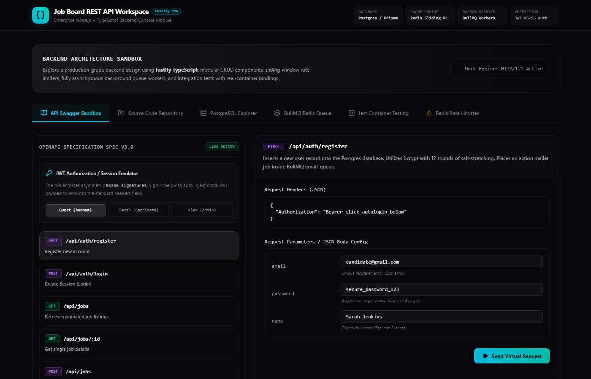
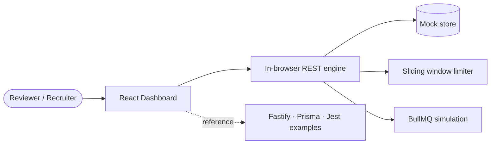

# Job Board API Workspace

**Interactive backend engineering console** — explore a production-style Job Board REST API with Swagger-style requests, Prisma data views, BullMQ queues, Redis rate limiting, and reference Fastify + TypeScript source code.

<p align="center">
  <a href="https://job-board-api-workspace-668971334330.europe-west2.run.app">
    
  </a>
</p>

<p align="center">
  <a href="https://job-board-api-workspace-668971334330.europe-west2.run.app"><strong>▶ Live demo</strong></a>
  &nbsp;·&nbsp;
  <a href="https://github.com/mkkbun/Job-Board-API-Workspace">Repository</a>
  &nbsp;·&nbsp;
  <a href="#getting-started">Run locally</a>
</p>

<p align="center">
  
  
  
  
  
</p>

---

## About this project

**Job Board API Workspace** is a portfolio-grade dashboard that demonstrates how a real-world hiring platform API is structured: authentication, role-based access, cursor pagination, background jobs, and sliding-window rate limits.

The UI runs entirely in the browser against an **in-memory mock API** (`src/data/mockServer.ts`), so reviewers can click through flows instantly with **no Postgres or Redis setup**. The **Source Code Repository** tab contains full reference implementations (Prisma schema, Fastify modules, middleware, Docker Compose, Jest + Testcontainers examples) aligned with the simulated behavior.

| | |
|---|---|
| **Live app** | [job-board-api-workspace-668971334330.europe-west2.run.app](https://job-board-api-workspace-668971334330.europe-west2.run.app) |
| **Hosting** | Google Cloud Run (Europe West 2) |
| **Stack** | React 19 · Vite 6 · TypeScript · Tailwind CSS 4 |

---

## Highlights

- **API Swagger Sandbox** — Execute REST calls with editable JSON bodies, custom headers, mock JWT injection, and Pino-style request logs.
- **PostgreSQL Explorer** — Browse seeded users, companies, jobs, and applications; reset state after demos.
- **BullMQ Redis Queue** — See `email-queue` jobs enqueue on register and apply flows.
- **Redis Rate Limiter** — Tune sliding-window settings and hammer the limiter to trigger `429 Too Many Requests`.
- **Jest + Testcontainers walkthrough** — Terminal simulation of integration tests against real Postgres containers.
- **Reference backend source** — Production patterns: `AppError` hierarchy, RS256 auth middleware, Zod validation, Prisma relations.

---

## Quick start (local)

```bash
git clone https://github.com/mkkbun/Job-Board-API-Workspace.git
cd Job-Board-API-Workspace
npm install
npm run dev
```

Open [http://localhost:3000](http://localhost:3000).

```bash
npm run build    # production build
npm run preview  # serve dist/
npm run lint     # TypeScript check
```

---

## Try the live demo

1. Open the **[live app](https://job-board-api-workspace-668971334330.europe-west2.run.app)**.
2. Go to **API Swagger Sandbox** → use **Sarah (Candidate)** or **Alex (Admin)** to inject a Bearer token.
3. Run `GET /api/jobs` or `POST /api/applications`.
4. Switch to **PostgreSQL Explorer** and **BullMQ Redis Queue** to see data and jobs update.
5. Open **Redis Rate Limitter** and click **Hammer Server** until you hit the sliding window cap.

### Demo accounts

| Role | Email | Swagger shortcut |
|------|-------|------------------|
| Admin | `engineering@techjobs.com` | Alex (Admin) |
| Applicant | `candidate@gmail.com` | Sarah (Candidate) |
| Moderator | `moderator@techjobs.com` | Login flow |

---

## API endpoints (mock engine)

| Method | Path | Auth | Description |
|--------|------|------|-------------|
| `POST` | `/api/auth/register` | — | Register user; enqueue welcome email |
| `POST` | `/api/auth/login` | — | Session tokens (mock RS256 JWT) |
| `GET` | `/api/jobs` | Optional | Cursor-paginated listings |
| `GET` | `/api/jobs/:id` | Optional | Job detail with company |
| `POST` | `/api/jobs` | Admin / Mod | Create listing |
| `POST` | `/api/applications` | User | Submit application |
| `PATCH` | `/api/applications/:id/status` | Admin / Mod | Update hiring status |

---

## Architecture



**Reference production stack:** Fastify · PostgreSQL · Prisma · Redis · BullMQ · JWT RS256 · Jest · Testcontainers

---

## Project structure

```
├── docs/preview.png          # README showcase screenshot
├── src/
│   ├── App.tsx               # Workspace shell & tabs
│   ├── components/           # Swagger, DB, Queue, Tests, Rate limit
│   ├── data/
│   │   ├── mockServer.ts     # Mock API router & in-memory DB
│   │   └── sourceFiles.ts    # Reference backend source
│   └── types.ts              # Endpoint definitions
├── package.json
└── vite.config.ts
```

---

## Deployment

This repo builds a static Vite app (`dist/`). The **[live demo](https://job-board-api-workspace-668971334330.europe-west2.run.app)** is deployed to **Google Cloud Run**.

Typical build for Cloud Run or any static host:

```bash
npm run build
# Serve dist/ with your container or static hosting
```

---

## Roadmap

- [ ] Extract mock routes into a real Fastify service
- [ ] Connect Prisma to PostgreSQL
- [ ] Wire Redis + BullMQ for production rate limits and workers
- [ ] Ship OpenAPI 3 spec from route schemas

---

## Author

**[mkkbun](https://github.com/mkkbun)** — Backend & full-stack portfolio project.

---

## License

[MIT](LICENSE) © 2026 [mkkbun](https://github.com/mkkbun)
